<div align="center">


### AI-Powered Marketing & Media Platform

[](https://www.typescriptlang.org/)
[](https://bun.sh/)
[](LICENSE)

</div>

---

Adcelerate is a monorepo powering an AI-driven marketing and media platform. It houses multiple systems — from image generation studios to video pipelines — along with a rich library of skills, agents, and commands orchestrated through Claude Code.

---

## 📑 Table of Contents

- [📦 Systems](#systems)
- [🏗 Architecture](#architecture)
- [🛠 Tech Stack](#tech-stack)
- [📚 Library](#library)
- [🚀 Getting Started](#getting-started)
- [📂 Project Structure](#project-structure)
- [🤝 Contributing](#contributing)
- [📄 License](#license)

---

## 📦 Systems

| System | Description | Status |
|--------|-------------|--------|
| [**autoCaption**](systems/autoCaption) | Automated video captioning system using Whisper.cpp for transcription and Remotion for rendering TikTok-style word-highlighted captions onto vertical video |  |
| [**SceneBoard**](systems/scene-board) | CLI-driven storyboard creation system that transforms video briefs of any format into professional storyboards with scripts, timestamps, voice scripts, and NanoBanana Pro prompts for visual generation — leveraging marketing, sales, social media, and ads skills |  |
| [**Pinboard**](systems/pinboard) | Terminal-first reference board and AI image generator (Ink TUI) — Pinterest URL import, ImageEngine generation, PromptWriter per-model prompt formatting, Claude Code vision tagging |  |
| [**Instagram Scrapper**](systems/instagram-scrapper) | Instagram content scraper that extracts posts, reels, and profile data using login-based Instagram Private API access with browser-automated authentication and media downloading |  |
| [**ImageEngine**](systems/image-engine) | Centralized NanoBanana image generation service using WisGate (JuheAPI) with rate limiting, token-based cost tracking, budget guards, retry/backoff, batch parallel execution, and generation gallery |  |
| [**ReadmeEngine**](systems/readme-engine) | Automated README generation and maintenance engine that produces best-in-class documentation for the monorepo, systems, and sub-projects using knowledge infrastructure |  |
| [**PromptWriter**](systems/prompt-writer) | Centralized prompt engineering knowledge system with per-model guides, visual direction references, and a model registry for AI image, video, and voice generation — the single authority for prompt writing across all Adcelerate systems |  |

---

## 🏗 Architecture


### Dependency Topology

```mermaid
graph TD
    autocaption[autocaption]
    autocaption --> bun
    autocaption --> ffmpeg
    autocaption --> whisper_cpp
    autocaption --> remotion
    pinboard[pinboard]
    pinboard --> bun
    pinboard --> sqlite
    pinboard --> google_ai
    pinboard --> vite
    pinboard --> fal_ai
    instagram_scrapper[instagram-scrapper]
    instagram_scrapper --> bun
    instagram_scrapper --> playwright
    instagram_scrapper --> instagram_private_api
    scene_board[scene-board]
    scene_board --> bun
    scene_board --> fal_ai
    scene_board --> google_ai
    scene_board --> remotion
    image_engine[image-engine]
    image_engine --> bun
    image_engine --> wisgate_api
    image_engine --> sqlite
    readme_engine[readme-engine]
    readme_engine --> bun
    prompt_writer[prompt-writer]
    prompt_writer --> bun
```



---

## 🛠 Tech Stack

### Frontend

| Technology | Purpose |
|------------|---------|
| **@remotion/cli 4** | Remotion CLI |
| **React 19** | UI framework |
| **React-dom 19** | React DOM renderer |
| **Remotion 4** | Programmatic video rendering |

### Backend

| Technology | Purpose |
|------------|---------|
| **TypeScript 5.9** | Type safety |
| **Bun** | JavaScript runtime & package manager |
| **Zod 4** | Schema validation |
| **Playwright 1** | Browser automation & testing |
| **Hono 4** | Lightweight web framework |
| **Js-yaml 4** | YAML parsing |

---

## 📚 Library

| Category | Count |
|----------|-------|
| Skills | 34 |
| Agents | 10 |
| Commands | 11 |

### Top Skills

| Skill | Description |
|-------|-------------|
| **ab-test-setup** | When the user wants to plan, design, or implement an A/B test or experiment. |
| **ad-creative** | When the user wants to generate, iterate, or scale ad creative — headlines, descriptions, primary text, or full ad variations — for any paid advertising platform. |
| **ai-seo** | When the user wants to optimize content for AI search engines, get cited by LLMs, or appear in AI-generated answers. |
| **analytics-tracking** | When the user wants to set up, improve, or audit analytics tracking and measurement. |
| **churn-prevention** | When the user wants to reduce churn, build cancellation flows, set up save offers, recover failed payments, or implement retention strategies. |
| **cold-email** | Write B2B cold emails and follow-up sequences that get replies. |
| **competitor-alternatives** | When the user wants to create competitor comparison or alternative pages for SEO and sales enablement. |
| **content-strategy** | When the user wants to plan a content strategy, decide what content to create, or figure out what topics to cover. |
| **copy-editing** | When the user wants to edit, review, or improve existing marketing copy. |
| **copywriting** | When the user wants to write, rewrite, or improve marketing copy for any page — including homepage, landing pages, pricing pages, feature pages, about pages, or product pages. |

### Top Agents

| Agent | Description |
|-------|-------------|
| **adcelerate-formalizer** | Reviews and structures knowledge captured during Build Mode interviews into agent-optimized format. Ensures frontmatter compliance, consistent structure, and proper acceptance criteria formatting. |
| **adcelerate-scaffolder** | Scaffolds new system sub-projects from the base template, adding system-specific files based on captured knowledge. Use during Build Mode step 4 to create the system's project structure. |
| **adcelerate-validator** | Independent validation reviewer that checks output against soft acceptance criteria with a fresh context window. Produces structured validation reports. Use during Execute Mode validation and Build Mode step 5. |
| **docs-scraper** | Documentation scraping specialist. |
| **meta-agent** | Generates a new, complete Claude Code sub-agent configuration file from a user's description. |
| **scout-report-suggest-fast** | Quickly scout codebase issues, identify problem locations, and suggest resolutions. Specialist for read-only analysis and reporting without making changes. |
| **scout-report-suggest** | Scout codebase issues, identify problem locations, and suggest resolutions. Specialist for read-only analysis and reporting without making changes. |
| **task-router** | Reads library.yaml to determine the best skill, agent, or command for a given task. |
| **team/builder** | Generic engineering agent that executes ONE task at a time. |
| **team/validator** | Read-only validation agent that checks if a task was completed successfully. |

---

## 🚀 Getting Started

### Prerequisites

- [**Bun**](https://bun.sh/) v1.0+ — `curl -fsSL https://bun.sh/install | bash`
- [**just**](https://github.com/casey/just) — command runner

### Install

```bash
# Clone the repository
git clone --recursive https://github.com/adcelerate/adcelerate.git
cd adcelerate

# Run setup
just install
```

---

## 📂 Project Structure

```
adcelerate/
├── systems/                # Independent processing systems
│   ├── autoCaption/            # Automated video captioning system using Whisper.cpp for transcription and Rem...
│   ├── SceneBoard/             # CLI-driven storyboard creation system that transforms video briefs of any for...
│   ├── Pinboard/               # Terminal-first reference board and AI image generator (Ink TUI) — Pinterest U...
│   ├── Instagram Scrapper/     # Instagram content scraper that extracts posts, reels, and profile data using ...
│   ├── ImageEngine/            # Centralized NanoBanana image generation service using WisGate (JuheAPI) with ...
│   ├── ReadmeEngine/           # Automated README generation and maintenance engine that produces best-in-clas...
│   └── PromptWriter/           # Centralized prompt engineering knowledge system with per-model guides, visual...
├── apps/                   # Deployable applications
├── knowledge/              # Shared knowledge base
├── scripts/                # Automation scripts
├── docs/                   # Documentation
├── justfile                # Command runner recipes
├── systems.yaml            # System registry
└── library.yaml            # Skills & agents catalog
```

---

## 🤝 Contributing

Contributions are welcome! Here's how to get started:

1. Fork the repository
2. Create a feature branch: `git checkout -b feat/my-feature`
3. Make your changes and ensure tests pass
4. Commit your changes and open a pull request

---

## 📄 License

This project is licensed under the [MIT License](LICENSE).

---

<div align="center">

**Built with** 🧡 **using Bun, TypeScript, and Claude Code**

</div>
