<div align="center">


### AI-Powered Marketing & Media Platform

[](https://www.typescriptlang.org/)
[](https://bun.sh/)
[](LICENSE)

</div>

---

Adcelerate is an open-source monorepo for AI-powered marketing and media work. It bundles ten independent systems — covering image generation, video storyboards, caption rendering, scraping, and a reusable prompt knowledge base — with a curated library of skills, agents, and commands orchestrated through Claude Code.

---

## 📑 Table of Contents

- [✨ Features](#-features)
- [📦 Systems](#-systems)
- [🏗 Architecture](#-architecture)
- [🛠 Tech Stack](#-tech-stack)
- [📚 Library](#-library)
- [🚀 Getting Started](#-getting-started)
- [🚀 Usage](#-usage)
- [⚙️ Configuration](#️-configuration)
- [📂 Project Structure](#-project-structure)
- [🤝 Contributing](#-contributing)
- [📄 License](#-license)

---

## ✨ Features

| Feature | Description |
|---------|-------------|
| **AutoEditor** | Dual-engine AI video editor for short-form content — a timeline-composition engine assembles clips, transitions, and audio while a motion-graphics engine paints word-highlighted captions and animated overlays (Whisper.cpp + Remotion), all driven from a CLI. |
| **SceneBoard** | Brief-to-storyboard CLI for short-form video — composite multi-panel storyboard sheets (GPT Image 2 via Higgsfield, ImageEngine fallback) plus a Phase 2 cinematic video prompt. |
| **Pinboard** | Terminal-first reference board with built-in AI image generation — Pinterest-style import, ImageEngine generations, and Claude vision tagging in an Ink TUI. |
| **Instagram Scrapper** | Instagram post, reel, and profile extractor — authenticates via a browser-driven Private API login and downloads media to disk. |
| **ImageEngine** | Centralized NanoBanana image-generation gateway over WisGate — rate-limited, budget-tracked, batch-capable HTTP service with retries and a generation gallery. |
| **ReadmeEngine** | Drift-aware README generator for the monorepo — pulls from systems.yaml, library.yaml, package manifests, and live git state to produce consistent docs. |
| **MoodBoarder** | Per-client Pinterest moodboard generator — analyzes a reference with Claude vision, derives search keywords, scrapes high-res images/videos into per-deliverable folders. |
| **PromptWriter** | Single source of prompt-engineering knowledge — per-model writing guides, style anchors, and a registry of image/video/voice models referenced by every other system. |

---

## 📦 Systems

| System | Description | Status |
|--------|-------------|--------|
| [**AutoEditor**](systems/auto-editor) | AI video editor for short-form content. A dual-engine pipeline: Hyperframes renders motion-graphic clips (HTML->mp4), Remotion composites them with whisper.cpp captions and deterministic shadergradient backgrounds into a JSON-driven multi-track timeline, then exports MP4 — via a CLI (caption/edit/serve) or an interactive @remotion/player browser editor. Grew out of the autoCaption caption renderer (caption path retained for back-compat). |  |
| [**SceneBoard**](systems/scene-board) | Brief-to-storyboard CLI for short-form video. Turns rough scripts and references into a composite multi-panel storyboard SHEET image (≤15s per sheet, GPT Image 2 via the Higgsfield CLI with ImageEngine fallback) plus a Phase 2 cinematic video prompt — with 4-view character/product reference sheets and timecoded panels. |  |
| [**Pinboard**](systems/pinboard) | Terminal-first reference board with built-in AI image generation. Pinterest-style import, ImageEngine generations, PromptWriter formatting, and Claude Code vision tagging — all in an Ink TUI. |  |
| [**Instagram Scrapper**](systems/instagram-scrapper) | Instagram post, reel, and profile extractor. Authenticates against the Instagram Private API via a browser-driven login and downloads media to disk. |  |
| [**ImageEngine**](systems/image-engine) | Centralized NanoBanana image-generation gateway over WisGate. Rate-limited, budget-tracked, batch-capable HTTP service with retries and a built-in generation gallery. |  |
| [**ReadmeEngine**](systems/readme-engine) | Drift-aware README generator for the monorepo. Pulls from systems.yaml, library.yaml, package manifests, and live git state to produce consistent docs for the root, every system, and every app. |  |
| [**MoodBoarder**](systems/MoodBoarder) | Per-client Pinterest moodboard generator. Given an image or video reference (plus optional text description), MoodBoarder analyzes the visual style with Claude vision, generates Pinterest search keywords, scrapes high-resolution images and/or videos, and assembles them into a timestamped per-client / per-deliverable folder. |  |
| [**PromptWriter**](systems/prompt-writer) | Single source of prompt-engineering knowledge. Per-model writing guides, style anchors, and a registry of image, video, and voice generation models referenced by every other system. |  |
| [**ScrapeEngine**](systems/scrape-engine) | Centralized adaptive web-scraping gateway over the Scrapling framework. Spawns a uv-run Python sidecar (StealthyFetcher / DynamicFetcher / Fetcher) with anti-bot + Cloudflare bypass and adaptive CSS element tracking, exposing a generic TypeScript client + CLI that other systems call to fetch and extract from markup-drifting sites. |  |
| [**PostBoard**](systems/post-board) | Brand-aware social post & carousel studio. Turns a short brief into on-brand Instagram/Facebook/LinkedIn posts and carousels for Dragonhearted Labs — generating copy via the best copy skills and a catchy cover (CSS riso default, optional Higgsfield background), then opening an editable DOM/CSS slide editor (move/resize/rotate layers, brand-only fonts & colors, riso/ink-bleed treatments) served by a local Bun + Hono server, and exporting one PNG per slide plus a combined PDF. |  |

---

## 🏗 Architecture


### Dependency Topology

```mermaid
graph TD
    auto_editor[auto-editor]
    auto_editor --> bun
    auto_editor --> ffmpeg
    auto_editor --> whisper_cpp
    auto_editor --> remotion
    auto_editor --> hyperframes
    auto_editor --> three
    auto_editor --> motion
    pinboard[pinboard]
    pinboard --> bun
    pinboard --> sqlite
    pinboard --> google_ai
    pinboard --> vite
    pinboard --> fal_ai
    instagram_scrapper[instagram-scrapper]
    instagram_scrapper --> bun
    instagram_scrapper --> playwright
    instagram_scrapper --> instagram_private_api
    scene_board[scene-board]
    scene_board --> bun
    scene_board --> image_engine
    scene_board --> fal_ai
    scene_board --> google_ai
    scene_board --> remotion
    image_engine[image-engine]
    image_engine --> bun
    image_engine --> wisgate_api
    image_engine --> higgsfield
    image_engine --> sqlite
    readme_engine[readme-engine]
    readme_engine --> bun
    prompt_writer[prompt-writer]
    prompt_writer --> bun
    moodboarder[moodboarder]
    moodboarder --> bun
    moodboarder --> ffmpeg
    moodboarder --> playwright
    moodboarder --> pinterest
    moodboarder --> claude_ai
    moodboarder --> scrape_engine
    scrape_engine[scrape-engine]
    scrape_engine --> bun
    scrape_engine --> uv
    scrape_engine --> scrapling
    scrape_engine --> camoufox
    post_board[post-board]
    post_board --> bun
    post_board --> hono
    post_board --> playwright
    post_board --> image_engine
    post_board --> higgsfield
```



---

## 🛠 Tech Stack

### Frontend

| Technology | Purpose |
|------------|---------|
| **Remotion CLI 4** | Remotion CLI |
| **Remotion Renderer 4** | Remotion server-side renderer |
| **React 19** | UI framework |
| **React-dom 19** | React DOM renderer |
| **Remotion 4** | Programmatic video rendering |
| **Remotion Bundler 4** | Remotion bundler |

### Backend

| Technology | Purpose |
|------------|---------|
| **TypeScript 5.9** | Type safety |
| **Bun** | JavaScript runtime & package manager |
| **Hono 4** | Lightweight web framework |
| **Zod 4** | Schema validation |
| **Playwright 1** | Browser automation & scraping |
| **js-yaml 4** | YAML parsing |

---

## 📚 Library

| Category | Count |
|----------|-------|
| Skills | 61 |
| Agents | 10 |
| Commands | 12 |

### Top Skills

| Skill | Description |
|-------|-------------|
| **ab-test-setup** | When the user wants to plan, design, or implement an A/B test or experiment. |
| **ad-creative** | When the user wants to generate, iterate, or scale ad creative — headlines, descriptions, primary text, or full ad variations — for any paid advertising platform. |
| **ai-seo** | When the user wants to optimize content for AI search engines, get cited by LLMs, or appear in AI-generated answers. |
| **analytics-tracking** | When the user wants to set up, improve, or audit analytics tracking and measurement. |
| **auto-editor-workflow** | The end-to-end auto-editor pipeline — ingest raw footage, transcribe & caption with whisper.cpp, generate motion-graphic clips with Hyperframes, add gradient/textured backgrounds with ShaderGradient, assemble a JSON timeline, preview/edit in the browser editor, and export MP4 with Remotion. Use when building or running the auto-editor, wiring its stages together, or understanding how captions, motion clips, backgrounds, and the timeline fit into a single render. Triggers: "auto-editor pipeline", "caption and edit a video", "assemble the timeline", "export the edit", "how does the editor work end to end". |
| **churn-prevention** | When the user wants to reduce churn, build cancellation flows, set up save offers, recover failed payments, or implement retention strategies. |
| **watch** | Watch a video (URL or local path). Downloads with yt-dlp, extracts auto-scaled frames with ffmpeg, pulls the transcript from captions (or Whisper API fallback), and hands the result to Claude so it can answer questions about what's in the video. |
| **cold-email** | Write B2B cold emails and follow-up sequences that get replies. |
| **competitor-alternatives** | When the user wants to create competitor comparison or alternative pages for SEO and sales enablement. |
| **content-strategy** | When the user wants to plan a content strategy, decide what content to create, or figure out what topics to cover. |

### Top Agents

| Agent | Description |
|-------|-------------|
| **adcelerate-formalizer** | Reviews and structures knowledge captured during Build Mode interviews into agent-optimized format. Ensures frontmatter compliance, consistent structure, and proper acceptance criteria formatting. |
| **adcelerate-scaffolder** | Scaffolds new system sub-projects from the base template, adding system-specific files based on captured knowledge. Use during Build Mode step 4 to create the system's project structure. |
| **adcelerate-validator** | Independent validation reviewer that checks output against soft acceptance criteria with a fresh context window. Produces structured validation reports. Use during Execute Mode validation and Build Mode step 5. |
| **docs-scraper** | Documentation scraping specialist. |
| **meta-agent** | Generates a new, complete Claude Code sub-agent configuration file from a user's description. |
| **scout-report-suggest-fast** | Quickly scout codebase issues, identify problem locations, and suggest resolutions. Specialist for read-only analysis and reporting without making changes. |
| **scout-report-suggest** | Scout codebase issues, identify problem locations, and suggest resolutions. Specialist for read-only analysis and reporting without making changes. |
| **task-router** | Reads library.yaml to determine the best skill, agent, or command for a given task. |
| **team/builder** | Generic engineering agent that executes ONE task at a time. |
| **team/validator** | Read-only validation agent that checks if a task was completed successfully. |

---

## 🚀 Getting Started

### Prerequisites

- Bun v1.0+ (JavaScript runtime & package manager) — curl -fsSL https://bun.sh/install | bash
- git (with submodule support) — required to clone the monorepo and its system submodules
- just (command runner) — brew install just  (drives the monorepo recipes in justfile)
- Per-system native dependencies (install only for the systems you run): ffmpeg (AutoEditor, MoodBoarder), whisper.cpp (AutoEditor transcription), Playwright + Chromium (Instagram Scrapper, MoodBoarder browser login), the Higgsfield CLI (SceneBoard primary image transport), and the Claude CLI (MoodBoarder, SceneBoard).

### Install

```bash
git clone --recursive https://github.com/adcelerate/adcelerate.git
cd adcelerate
git submodule update --init --recursive   # if you cloned without --recursive (or: just sub-init)
cd systems/readme-engine && bun install   # each system manages its own deps — repeat `cd systems/<system> && bun install` for each one you run (no monorepo-wide install)
```

---

## 🚀 Usage

### 1. Bootstrap the monorepo (each system is a git submodule)

```bash
git submodule update --init --recursive   # or: just sub-init
cd systems/readme-engine && bun install     # install deps per system you run (no monorepo-wide install)
```

> **Expected:** All eight systems under systems/ are checked out; the chosen system's dependencies are installed. Run `just sub-update` later to pull submodules to their latest remote.

### 2. Start the Claude Command Center (browser dashboard)

```bash
just cc-install     # first run only: install web + orchestrator deps
just cc-dev
```

> **Expected:** Dashboard at http://localhost:3000 and orchestrator at http://localhost:4100; Ctrl-C the `cc-dev` process to stop both.

### 3. Run a representative system (ReadmeEngine — no credentials required)

```bash
cd systems/readme-engine && bun run src/cli.ts generate --target root
```

> **Expected:** Regenerates the root README.md from the registry and knowledge sources. Each system runs standalone from its own directory; some also expose a justfile (`just sub <system> <recipe>`).

### 4. Browse skills, agents, and commands from the library catalog

```bash
/library
```

> **Expected:** Inside a Claude Code session, lists the curated skills/agents/commands from library.yaml so you can route a task to the right system.

### Command Reference

| Command | Description |
|---------|-------------|
| `just --list` | List every available monorepo recipe. |
| `just sub <system-path> <recipe>` | Run a recipe inside a system submodule that has its own justfile (e.g. `just sub systems/readme-engine check`). |
| `just systems-list` | List all registered systems and their status from systems.yaml. |
| `just systems-health` | Quick health check across all registered systems (knowledge + justfile presence). |
| `just cc-dev` | Start the Claude Command Center dashboard — orchestrator (:4100) + web (:3000). |

---

## ⚙️ Configuration

| Variable | Required | Description |
|----------|----------|-------------|
| `WISGATE_API_KEY` | No | Auth token for the WisGate gateway — powers ImageEngine (NanoBanana) generation and the SceneBoard ImageEngine fallback. |
| `ANTHROPIC_API_KEY` | No | Anthropic API key for Claude vision/text — used by MoodBoarder analysis and SceneBoard; the Claude CLI may supply this implicitly. |
| `GOOGLE_AI_API_KEY` | No | Google AI (Gemini) key — used by Pinboard and SceneBoard image generation paths. |
| `FAL_KEY` | No | fal.ai API key — optional image-generation transport for Pinboard and SceneBoard (NanoBanana Pro). |
| `HIGGSFIELD_API_KEY` | No | Higgsfield credentials for the global Higgsfield CLI — SceneBoard's primary GPT Image 2 composite-sheet / reference-sheet transport (set up via the CLI's own auth). |
| `IG_USERNAME / IG_PASSWORD` | No | Instagram account credentials for Instagram Scrapper's browser-driven Private API login (session cookies are persisted after first login). |

---

## 📂 Project Structure

```
adcelerate/
├── systems/                # Independent processing systems
│   ├── AutoEditor/             # AI video editor for short-form content
│   ├── SceneBoard/             # Brief-to-storyboard CLI for short-form video
│   ├── Pinboard/               # Terminal-first reference board with built-in AI image generation
│   ├── Instagram Scrapper/     # Instagram post, reel, and profile extractor
│   ├── ImageEngine/            # Centralized NanoBanana image-generation gateway over WisGate
│   ├── ReadmeEngine/           # Drift-aware README generator for the monorepo
│   ├── MoodBoarder/            # Per-client Pinterest moodboard generator
│   ├── PromptWriter/           # Single source of prompt-engineering knowledge
│   ├── ScrapeEngine/           # Centralized adaptive web-scraping gateway over the Scrapling framework
│   └── PostBoard/              # Brand-aware social post & carousel studio
├── apps/                   # Deployable applications
├── knowledge/              # Shared knowledge base
├── scripts/                # Automation scripts
├── docs/                   # Documentation
├── justfile                # Command runner recipes
├── systems.yaml            # System registry
└── library.yaml            # Skills & agents catalog
```

---

## 🤝 Contributing

Contributions are welcome! Here's how to get started:

1. Fork the repository
2. Create a feature branch: `git checkout -b feat/my-feature`
3. Make your changes and ensure tests pass
4. Commit your changes and open a pull request

---

## 📄 License

This project is licensed under the [MIT License](LICENSE).

---

<div align="center">

**Built with** 🧡 **using Bun, TypeScript, and Claude Code**

</div>
