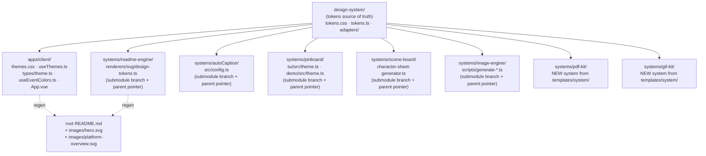

# Plan: Adcelerate Unified Design System Rollout (Refined)

## Context

The user wants every visible Adcelerate surface — observability dashboard, README hero/architecture SVGs, Remotion compositions, future PDF/GIF exports, and AI-generated imagery — to read from one design system. Today, palettes are scattered: `apps/client/src/styles/themes.css` uses `#3b82f6`-style generic blues across 12 themes; `apps/client/src/composables/useEventColors.ts:84` hardcodes `#6366F1`; submodule systems each carry their own colors; nothing is shared.

The draft plan was written assuming an `adcelerate-design-system/` handoff bundle is already on disk and that the repo is a Bun workspace with a `packages/` directory. **Neither is true today.** The refined plan reconciles with the actual repo state.

## Reality Check (Verified)

| Draft assumption | Actual repo state |
|---|---|
| `adcelerate-design-system/` bundle on disk | **Folder does not exist.** No `colors_and_type.css`, no `ui_kits/observability`, no `preview/`. Source URL `api.anthropic.com/v1/design/h/aaB1KVbEO5POg2v1DlmWBQ` returns 404. |
| `packages/` dir + Bun workspace | **No root `package.json`, no `packages/`.** Repo's pattern is per-app (`apps/server`, `apps/client`) and per-submodule (`systems/*`). New systems are scaffolded from `templates/system/`. |
| `WARP.md` at root | **No `WARP.md`** — root has `README.md`, `justfile`, `library.yaml`, `systems.yaml`. |
| Dashboard theme IDs include `paper` | Actual IDs (`apps/client/src/types/theme.ts:3`): `light, dark, modern, earth, glass, high-contrast, dark-blue, colorblind-friendly, ocean, midnight-purple, sunset-orange, mint-fresh`. |
| Submodules ready to edit | All 7 submodules **uninitialized** (`git submodule status` shows leading `-`). Need `just sub-init` first. |
| `apps/server/events.db` exists | Maintenance hook reports it missing — server has not been run yet. |

## Approach

Token-first. Establish `design-system/` at the repo root as the source of truth, then migrate every consumer — including each submodule — onto it in this rollout. The submodule mechanics (separate remotes, separate branches, parent-repo pointer bumps) are real but tractable; they're not a reason to scope them out.

Solid arrows = direct token consumption. Dotted = README/SVG regeneration after readme-engine is reskinned.

## Branch Isolation (Mandatory)

Nothing in this rollout touches `main` in any repo. Every commit lands on a dedicated branch, and every PR opens against `main` for review — no direct pushes to `main`, no fast-forward, no force-push.

- **Parent repo (`dragon-hearted/adcelerate`):** all work on `claude/refine-local-plan-d5Iox` (per the Git Development Branch Requirements). Created locally if missing; verified via `git branch --show-current` before any commit.
- **Each submodule repo:** its own branch named identically — `claude/refine-local-plan-d5Iox` — created with `git checkout -b claude/refine-local-plan-d5Iox` inside the submodule. Same name across all repos so the rollout is one named "release train" across 8 PRs.
- **No `main` writes anywhere.** Before each `git commit`/`git push`, the implementer asserts current branch via `git rev-parse --abbrev-ref HEAD` and aborts if it returns `main`/`master`.
- **No force-push.** All pushes are `git push -u origin claude/refine-local-plan-d5Iox` (no `--force`, no `--force-with-lease`). If a push is rejected (non-fast-forward), pull-rebase and try again rather than overwriting.

## Cross-Repo Commit Mechanics

Submodules each live in their own GitHub repo (`Dragon-hearted/autoCaption`, etc.). Per-submodule flow:

1. `just sub-init` once at the start (parent repo).
2. Inside each submodule: `git checkout -b claude/refine-local-plan-d5Iox`, edit, commit, `git push -u origin claude/refine-local-plan-d5Iox`.
3. In the parent repo: `git add systems/<name>` to stage the new submodule pointer, commit on `claude/refine-local-plan-d5Iox`.
4. Open one PR per submodule repo + the parent repo's PR. Parent PR description lists every child PR. Merge order: child PRs first, then parent (so the pointer bumps reference merged commits on the children's `main`).

The GitHub MCP server is scoped to `dragon-hearted/adcelerate`, so the submodule PRs themselves get opened by the user from each submodule clone (or via `gh` from the user's machine). The git push from inside the submodule still works through Bash because credentials apply to the org, not just one repo.

## Pre-flight (blocking)

P1. **DS bundle source.** `adcelerate-design-system/` is not on disk and the URL 404s. Three options, in preference order:
  - (a) User drops the actual handoff bundle into the repo root before implementation starts.
  - (b) User points at a working URL / S3 / gist / branch.
  - (c) Bootstrap a v0 bundle from the descriptive content in the original draft (paper/oxblood/petrol/amber/green/cocoa hexes; Inter/JetBrains Mono/Archivo Black/DM Serif Display/IBM Plex Serif/Press Start 2P/VT323; 12 theme variants; voice rules).

  **Recommendation:** ask the user which path. Without resolved tokens, every step downstream is guesswork.

P2. **Initialize submodules.** `just sub-init` so files exist on disk and edits can commit.

P3. **Create branches before any edit.** Parent repo: `git checkout -b claude/refine-local-plan-d5Iox` (or `git checkout claude/refine-local-plan-d5Iox` if it already exists). Each submodule, after `sub-init`: `cd systems/<name> && git checkout -b claude/refine-local-plan-d5Iox`. Verify with `git rev-parse --abbrev-ref HEAD` before the first commit in each repo.

## Files to Create

**Design system source** (in this parent repo, root-level `design-system/`):

- `design-system/README.md` — what's in here, how to consume, voice rules.
- `design-system/tokens.css` — master CSS custom properties for all 12 themes + type scale + spacing/radius/motion. Uses the existing `--theme-*` variable names (drop-in compat with `apps/client/src/styles/themes.css`) plus a `--ds-*` namespace for new tokens (event-hash colors, motion, radii, fonts).
- `design-system/tokens.ts` — typed mirror.
- `design-system/adapters/svg.ts` — exports `COLORS`, `DARK`, `FONTS`, `ANIM` matching the existing readme-engine consumer shape.
- `design-system/adapters/remotion.ts` — camelCase theme object for Remotion.
- `design-system/adapters/chalk.ts` — hex wrapper functions for Ink TUI; preserves the `caption()` uppercase helper currently in `pinboard/tui`.
- `design-system/adapters/ai-brand.ts` — `brandContextPrompt({ surface, theme?, mood? })` returning a prompt snippet (palette hexes + voice + banned imagery).
- `design-system/adapters/pdf.ts` — react-pdf `StyleSheet` + theme-aware tokens.
- `design-system/adapters/gif.ts` — composition constants (1080×1920, 800×800, motion timings).
- `design-system/preview/index.html` — static page rendering one card per theme so reviewers can eyeball.

**New systems** scaffolded from `templates/system/` and registered in `systems.yaml`:

- `systems/pdf-kit/` — `@react-pdf/renderer` based. Branded 1-page template, programmatic render entrypoint, smoke-test demo doc.
- `systems/gif-kit/` — Remotion → GIF pipeline. 2-scene `BrandIntro` composition, programmatic render entrypoint, smoke output.

## Files to Modify

**`apps/client/`** (in-repo, immediate):

- `src/styles/themes.css` — replace contents with `@import "../../../design-system/tokens.css";`. Keep the file as the import boundary so Tailwind/Vite HMR don't break.
- `src/styles/main.css` — add Google Fonts `@import` (or `<link>` in `index.html`).
- `tailwind.config.js` — extend `theme.fontFamily` with `display`, `editorial`, `hero`, `pixel`, `crt` keys pointing at CSS vars.
- `src/types/theme.ts:3` — keep existing 12 IDs (`light`, `dark`, …); do **not** rename. The DS palette ships under those IDs so saved `localStorage` prefs survive.
- `src/composables/useThemes.ts` — update each `PREDEFINED_THEMES` entry's `colors:` block to match the new CSS var hexes for in-memory previews.
- `src/composables/useEventColors.ts:84` — replace the `bg-indigo-500: '#6366F1'` literal map with a CSS-var-sourced map (`--ds-app-hash-*`).
- `src/App.vue` — on first mount with no saved preference, read `window.matchMedia('(prefers-color-scheme: dark)')` and apply `dark` else `light`. Saved prefs still win.
- `src/components/ThemeManager.vue` — visual smoke; no structural change unless swatches break.

**Submodules** (each on its own branch, separate commit + push):

- `systems/readme-engine/src/renderers/svg/design-tokens.ts` — replace contents with re-export from the parent's `design-system/adapters/svg.ts` (relative path through the submodule boundary; alternative is to copy the file in via a build step). Run `bun run generate:all` (or whatever the engine's generate command is) after the swap to regenerate every `images/*.svg` and `systems/*/images/*.svg`.
- `systems/autoCaption/src/config.ts` — replace `#39E508` default `highlightColor` with `#B45309` (brand-amber) sourced from the DS adapter.
- `systems/pinboard/tui/src/theme.ts` — chalk wrappers from `design-system/adapters/chalk.ts`. Map `warmParchment, ashGray, stoneGray, earthGray, mistBorder, linkGray, mutedOchre, mutedRust` to DS equivalents (`paper, muted, text-tertiary, text-primary, border-primary, text-quaternary, amber, oxblood`). Preserve `caption()`.
- `systems/pinboard/demo/src/theme.ts` — re-export from `design-system/adapters/remotion.ts`.
- `systems/scene-board/src/character-sheet-generator.ts` — add optional `designContext?: string` arg; default to `brandContextPrompt({ surface: 'character-sheet' })`; append into the existing brand-context string passed to the model.
- `systems/image-engine/scripts/generate-*.ts` — add `--brand` CLI flag that prepends `brandContextPrompt({ surface: 'product-shot' })` to the prompt.

**Cross-submodule import strategy:** submodules can't reach `../../design-system/` reliably because they're independent git repos. Two viable approaches:

- **Vendoring (recommended):** at submodule build time, copy `design-system/adapters/*.ts` and `tokens.css` into a `vendor/design-system/` folder inside the submodule (a `just sync-design` recipe at the parent level). The submodule treats `vendor/design-system/` as input; commits include the vendored files. Pro: submodule remains self-contained and testable solo. Con: drift unless `sync-design` is re-run.
- **Path import (faster, more brittle):** submodule TS imports `../../../design-system/adapters/...` and relies on the parent checkout. Breaks if someone clones the submodule alone. Skip.

Recommendation: vendor. Add `just sync-design` to the root justfile.

**Root**:

- `README.md` — add a Design System section linking `design-system/` and listing the consumer trail.
- `justfile` — add `sync-design` recipe (copies `design-system/` into each submodule's `vendor/design-system/`).
- `systems.yaml` — register `pdf-kit` and `gif-kit` after they're scaffolded.

## Step-by-step

1. **Pre-flight P1 — DS bundle source.** Resolve via AskUserQuestion before doing anything else.
2. **Pre-flight P2 — `just sub-init`.** Initialize all 7 submodules.
3. **Pre-flight P3 — branches.** In the parent repo and inside each submodule that will be edited: `git checkout -b claude/refine-local-plan-d5Iox` (or check out if it already exists). Confirm `git rev-parse --abbrev-ref HEAD` is the rollout branch in every repo before any subsequent step writes a file.
4. **Scaffold `design-system/`** (parent repo, on `claude/refine-local-plan-d5Iox`). Commit.
5. **Add `just sync-design`** in root justfile. Run it once to vendor adapters into every submodule (vendored files commit on each submodule's `claude/refine-local-plan-d5Iox`).
6. **Reskin `apps/client`** (themes.css → @import, useThemes/useEventColors hex remap, App.vue prefers-color-scheme, fonts, tailwind config). Smoke-test all 12 themes via dev server. Commit on parent `claude/refine-local-plan-d5Iox`.
7. **For each submodule on its own `claude/refine-local-plan-d5Iox` branch:**
   - `readme-engine`: swap design-tokens, regenerate SVGs, commit, `git push -u origin claude/refine-local-plan-d5Iox`.
   - `autoCaption`: swap highlight default, smoke render 30 frames, commit, push.
   - `pinboard/tui`: chalk migration, visual check, commit, push.
   - `pinboard/demo`: Remotion adapter, smoke render, commit, push.
   - `scene-board`: brandContextPrompt injection, generate one character sheet to verify, commit, push.
   - `image-engine`: `--brand` flag, generate one product shot, commit, push.
8. **Bump submodule pointers** in the parent repo (`git add systems/<name>` for each), commit on `claude/refine-local-plan-d5Iox`.
9. **Scaffold `systems/pdf-kit`** from `templates/system/`: add `@react-pdf/renderer`, branded template, render entrypoint, smoke doc. Register in `systems.yaml`. Commit on parent branch.
10. **Scaffold `systems/gif-kit`** from `templates/system/`: Remotion config, `BrandIntro` composition, render entrypoint, smoke output. Register in `systems.yaml`. Commit.
11. **Regenerate all READMEs** via readme-engine so every `systems/*/README.md` and root `README.md` reflects the new visuals. Commit.
12. **Validation pass** (see below). Commit `app_docs/ds-rollout/validation.md`.
13. **Push parent branch:** `git push -u origin claude/refine-local-plan-d5Iox`. Open parent PR against `main`; description links every submodule PR.

## Verification

Parent repo:

- `bun --cwd apps/client run typecheck` and `bun --cwd apps/client run build` — clean.
- `bun --cwd apps/client run dev` and load `http://localhost:5173`; toggle all 12 themes in `ThemeManager.vue`; clear `localStorage` and toggle OS dark mode to confirm `prefers-color-scheme` default.
- Open `design-system/preview/index.html` — all 12 theme cards render correctly.
- `rg '#[0-9A-Fa-f]{6}' apps systems -g '!**/node_modules/**' -g '!design-system/**' -g '!**/vendor/design-system/**' -g '!**/*.svg'` — orphan-hex scan; reviewer expects empty or short, explainable list.

Per submodule:

- `readme-engine`: `bun run generate:all`; visually diff `images/hero.svg` against the DS hero spec.
- `autoCaption`: `bunx remotion render Root out/ds-check.mp4 --frames=0-30` — succeeds; highlight no longer green.
- `pinboard/tui`: `bun --cwd systems/pinboard/tui run dev` — palette shifted to paper.
- `pinboard/demo`: `bunx remotion render Root out/ds-check.mp4 --frames=0-30` — succeeds.
- `scene-board`: log the prompt sent to the model; verify it includes the DS palette + voice block.
- `image-engine`: run with `--brand`; verify the prompt prepends the brand block.

New systems:

- `systems/pdf-kit`: `bun run pdf:render` produces `out/sample.pdf` with DS fonts + palette.
- `systems/gif-kit`: `bun run gif:render` produces `out/brand-intro.gif`.

Final report: `app_docs/ds-rollout/validation.md` summarizes runs, screenshots, orphan-hex list, open follow-ups.

## Open Questions for the User

1. **DS bundle source.** Drop locally, point at a URL, or bootstrap from the original draft's description?
2. **Submodule import strategy.** Vendor adapters (`just sync-design`, recommended) or relative path imports (brittle)?
3. **Theme ID naming.** Keep existing IDs (`light`, `dark`, …) and remap colors only — or full rename to DS names (`paper`, `oxblood-dark`, …) which breaks every saved `localStorage` preference and existing screenshot reference?
4. **Fonts loading.** CSS `@import` (simplest), `<link rel="preload">` in `index.html` (faster), or self-hosted `@font-face` (offline-friendly)?
