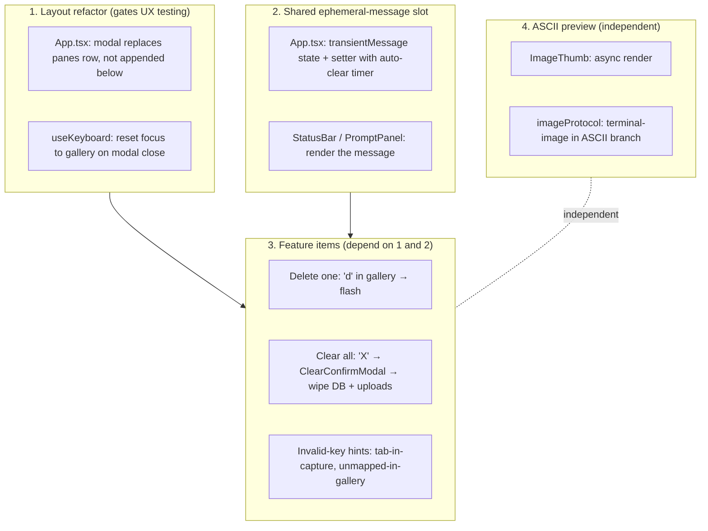

# Pinboard TUI — Tidy Toast Sweep

## Context

Pinboard (Ink/React TUI in `systems/pinboard/tui/`) has five usability gaps the user hit during real work:

1. No key to **delete one image** — the plumbing exists (`db.deleteImage` at `services/db.ts:188`, `useReferences.remove` at `hooks/useReferences.ts:167`) but isn't bound.
2. No way to **wipe everything** (factory reset) from the TUI.
3. **Help overlay looks frozen** — it renders *below* the main panes (`App.tsx:197`), so on normal terminal heights it pushes the overlay + StatusBar off-screen; keys register but UI looks dead.
4. **Silent invalid keys** — e.g. Tab inside the prompt editor is swallowed by `useKeyboard` (`hooks/useKeyboard.ts:65–70`) with no feedback.
5. **No preview** on terminals without Kitty/iTerm2 graphics — `utils/imageProtocol.ts:87–105` falls back to an empty labelled box.

Outcome: one release that makes reference management reversible, the help overlay actually modal, invalid keys guided, and previews work in any terminal.

## Shape of the change



## Approach by item

### 1. Layout refactor (prerequisite for 3 + 4)

`src/App.tsx` previously rendered the main panes row *and* the modal/overlay as sibling `<Box>`s, so both competed for vertical space. Changed to a branch:

```tsx
{modal === null ? (
  <Box flexDirection="row" flexGrow={1}>{/* gallery · prompt · preview */}</Box>
) : (
  <Box>{/* selected modal */}</Box>
)}
<StatusBar ... />  {/* always last, anchored */}
```

`HelpOverlay` now lives in the same modal slot as `AddFileModal`, `PinterestModal`, `ModelPicker`, `ClearConfirmModal`.

In `src/hooks/useKeyboard.ts` modal-layer Esc: after `setModal(null)`, also `setFocus("gallery")`. Prevents the "prompt still in captureMode after close" trap that read as a freeze.

### 2. Shared ephemeral-message slot

`src/App.tsx`:
```ts
const [message, setMessage] = useState<StatusMessage | null>(null);
const messageTimer = useRef<ReturnType<typeof setTimeout> | null>(null);
const flash = useCallback((text, tone = "info", ms = 2000) => {
  if (messageTimer.current) clearTimeout(messageTimer.current);
  setMessage({ text, tone });
  messageTimer.current = setTimeout(() => setMessage(null), ms);
}, []);
```

`StatusBar` accepts an optional `message` prop and renders it in place of the hint line, coloured by tone (`warmParchment` info / `mutedOchre` warn / `mutedRust` error — pulled from `theme.ts`, no new colours).

### 3. Delete one image — `d` in gallery

- `d` in `galleryKeymap` → `refs.remove(refs.references[refs.selectedIndex].id)`, then `flash("Removed {name}")`.
- Selection clamping was already handled by `useReferences.refresh` (`useReferences.ts:55`), no change needed.
- No confirmation modal — delete is reversible by re-upload, a toast is enough.

### 4. Clear everything — `X` → confirm

`src/services/db.ts` adds:
- `deleteAllImages()` — selects paths, unlinks each, `DELETE FROM images`, returns `{rows, files}`.
- `deleteAllGenerations()` — same but on `resultPath`.
- `purgeUploadOrphans()` — sweeps `uploads/` for files with no row.

`src/screens/ClearConfirmModal.tsx` (new) — modeled on `AddFileModal`. Modal id `"clear-confirm"`. `y`/`Enter` wipes; `n`/`Esc` cancels. Red warning text using `colors.mutedRust`.

`useKeyboard.ts` extends `ModalId` with `"clear-confirm"` and binds capital `X` next to `a`, `p`, `m`.

`App.tsx` confirm handler runs all three DB clears, refreshes both hooks, and flashes `"Cleared N images, M generations (K files)"`.

### 5. Invalid-key hints

`useKeyboard.ts` adds optional `onInvalidKey?(reason: string)`:
- captureMode + `key.tab` → `"Press Enter to commit, then Tab to switch panes."`
- pane keymap miss + printable single char (skip arrows / ctrl / meta) → `"Unknown key 'x'. Press ? for help."`

`App.tsx` wires `onInvalidKey={(r) => flash(r, "warn", 1800)}`.

### 6. ANSI preview fallback

Added `terminal-image@4.3.0` to `tui/package.json`.

`src/utils/imageProtocol.ts`:
- `renderThumb` is now async, returns `Promise<string>`.
- Native protocols (Kitty / iTerm2) unchanged — synchronous base64 wrapped in `Promise.resolve` semantics.
- Sixel + ASCII branches both call `terminalImage.file(path, { width: cols, height: rows*2, preferNativeRender: false })` — `*2` because half-blocks render two pixels per row. `preferNativeRender: false` keeps terminal-image from re-emitting iTerm/Kitty escapes that we already produced ourselves above.
- Trailing `\n` from terminal-image is stripped to keep layout stable.

`src/components/ImageThumb.tsx`:
- `useEffect` triggers `renderThumb` on mount / prop change; sets `payload` state.
- Renders a sized `<Box>` placeholder showing `"…"` until the first frame resolves — prevents layout jitter.

## Files touched

Submodule (`systems/pinboard/tui/`):

| File | Change |
|------|--------|
| `src/App.tsx` | Modal-replaces-panes layout; `message` state + `flash`; bind `d`, `X`; wire confirm handler |
| `src/hooks/useKeyboard.ts` | `onInvalidKey` callback; Tab-in-capture hint; unmapped-key hint; modal-close focus reset; `X` binding; `"clear-confirm"` id |
| `src/services/db.ts` | `deleteAllImages`, `deleteAllGenerations`, `purgeUploadOrphans` |
| `src/screens/ClearConfirmModal.tsx` | **new** |
| `src/components/StatusBar.tsx` | Optional `message` prop with tone colouring |
| `src/components/ImageThumb.tsx` | Async render + sized placeholder |
| `src/utils/imageProtocol.ts` | `terminal-image` ANSI half-block path; `Promise<string>` return type |
| `package.json` / `bun.lock` | `terminal-image@4.3.0` |

Parent repo: submodule pointer bumped via a single commit on `pinboard-ci-fix`.

## Verification

Typecheck is necessary but not sufficient — this is a TUI.

1. `cd systems/pinboard/tui && bun run typecheck` → exits 0. ✅
2. `bun test` → 75 passing, 0 failing. ✅
3. **Delete:** upload via `a`, highlight, press `d` → entry disappears, status flashes, file gone from `uploads/`.
4. **Clear all:** with refs + ≥1 generation, press `X`, confirm → gallery empty, both tables zero rows, `uploads/` empty.
5. **Help modal:** from gallery `?` → overlay replaces panes (does NOT push them off-screen); `?`/`Esc` closes cleanly. Open from prompt focus, close → can hit `j`/`k` immediately.
6. **Invalid keys:** focus prompt with Tab, press Tab → "Press Enter to commit, then Tab to switch panes." for ~2s. From gallery press `z` → "Unknown key 'z'. Press ? for help."
7. **Preview fallback:** in plain Terminal.app / xterm, select an upload → half-block colour thumbnail renders in gallery + Preview panes. In Kitty/iTerm, behaviour unchanged.

## Out of scope

- Undo for delete (a toast is enough; re-upload is trivial).
- Sixel native protocol (the half-block path covers WezTerm well enough).
- Confirmation for single-image delete (would add friction for a reversible action).

---

<!-- Plan-template aliases — this spec predates the standard plan format. The canonical headers below alias the existing sections; do not duplicate content. -->

## Task Description
See **Context** at the top of this file.

## Objective
See the final paragraph of **Context** ("Outcome: …").

## Relevant Files
See **Files touched**.

## Step by Step Tasks
See **Approach by item** (sections 1–6).

## Acceptance Criteria
See **Verification** (items 1–7).

## Team Orchestration

### Team Members
N/A — single-author execution; no agent team.

