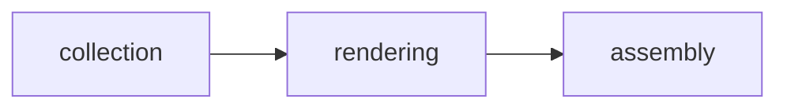

<div align="center">


### Automated README generation and maintenance engine that produces best-in-class documentation for the monorepo, systems, and sub-projects using knowledge infrastructure


[](https://www.typescriptlang.org/)
[](https://bun.sh/)

</div>

---

## 📑 Table of Contents

- [✨ Features](#features)
- [🏗 Architecture](#architecture)
- [🛠 Tech Stack](#tech-stack)
- [🚀 Getting Started](#getting-started)
- [💻 Development](#development)
- [📂 Project Structure](#project-structure)
- [🤝 Contributing](#contributing)
- [📄 License](#license)

---

## ✨ Features

| Feature | Description |
|---------|-------------|
| **readme-generation** | Core task type |
| **documentation-update** | Core task type |
| **drift-detection** | Core task type |
| **monorepo-filesystem Input** | Supported input type |
| **systems-yaml Input** | Supported input type |
| **library-yaml Input** | Supported input type |
| **graph-yaml Input** | Supported input type |
| **package-json Input** | Supported input type |
| **git-history Input** | Supported input type |
| **readme-md Output** | Supported output type |
| **drift-report-json Output** | Supported output type |

---

## 🏗 Architecture


ReadmeEngine processes data through a multi-stage pipeline:



---

## 🛠 Tech Stack

### Backend

| Technology | Purpose |
|------------|---------|
| **TypeScript 5.7** | Type safety |
| **Bun** | JavaScript runtime & package manager |
| **Js-yaml 4** | YAML parsing |

---

## 🚀 Getting Started

### Prerequisites

- [**Bun**](https://bun.sh/) v1.0+ — `curl -fsSL https://bun.sh/install | bash`

### Install

```bash
cd systems/readme-engine
bun install
```

### Run

```bash
bun run systems/readme-engine/src/cli.ts
```

---

## 💻 Development

| Command | Description |
|---------|-------------|
| `bun run dev` | Start development mode |
| `bun run build` | Build for production |
| `bun test` | Run tests |
| `bun run lint` | Check code quality |

---

## 📂 Project Structure

```
readme-engine/
├── README.md
├── biome.json
├── images
│   ├── hero.svg
│   └── pipeline.svg
├── justfile
├── knowledge
│   ├── acceptance-criteria.md
│   ├── dependencies.md
│   ├── domain.md
│   ├── history.md
│   └── index.md
├── logs
│   ├── 109ade25-da92-495d-a1fd-203b210ee16d
│   │   ├── chat.json
│   │   ├── post_tool_use.json
│   │   ├── post_tool_use_failure.json
│   │   ├── pre_tool_use.json
│   │   └── stop.json
│   ├── 3069c628-b142-4b8f-90db-92782a6f70ad
│   │   ├── chat.json
│   │   ├── post_tool_use.json
│   │   ├── pre_tool_use.json
│   │   └── stop.json
│   ├── 4d33eaf3-bfbc-4baf-a190-7adc917557ff
│   │   ├── chat.json
│   │   ├── post_tool_use.json
│   │   ├── pre_tool_use.json
│   │   └── stop.json
│   ├── 7ba10a7c-43a8-49cf-a1f3-d5f230c50640
│   │   ├── chat.json
│   │   ├── post_tool_use.json
│   │   ├── pre_tool_use.json
│   │   └── stop.json
│   ├── 93dff7f9-640d-43b1-a116-8163bd9890bf
│   │   ├── chat.json
│   │   ├── post_tool_use.json
│   │   ├── pre_tool_use.json
│   │   └── stop.json
│   ├── afed2c6d-200c-4f1e-ae6a-86cfbabd2354
│   │   ├── chat.json
│   │   ├── post_tool_use.json
│   │   ├── post_tool_use_failure.json
│   │   ├── pre_tool_use.json
│   │   └── stop.json
│   ├── e5661a24-4092-4482-bf69-0127f1d35f6d
│   │   ├── chat.json
│   │   ├── post_tool_use.json
│   │   ├── post_tool_use_failure.json
│   │   ├── pre_tool_use.json
│   │   └── stop.json
│   ├── e8c5becc-9a54-4194-a263-c97f9197765d
│   │   ├── chat.json
│   │   ├── post_tool_use.json
│   │   ├── pre_tool_use.json
│   │   └── stop.json
│   └── session_end.json
├── package.json
├── src
│   ├── cli.ts
│   ├── collectors
│   │   ├── app-collector.ts
│   │   ├── code-collector.ts
│   │   ├── git-collector.ts
│   │   ├── graph-collector.ts
│   │   ├── index.ts
│   │   ├── library-collector.ts
│   │   └── system-collector.ts
│   ├── drift
│   │   ├── detector.ts
│   │   ├── fingerprint.ts
│   │   ├── index.ts
│   │   └── report.ts
│   ├── generate.ts
│   ├── index.ts
│   ├── renderers
│   │   ├── api-reference.ts
│   │   ├── architecture.ts
│   │   ├── badges.ts
│   │   ├── changelog.ts
│   │   ├── gif-references.ts
│   │   ├── index.ts
│   │   ├── mermaid.ts
│   │   ├── project-structure.ts
│   │   ├── tech-stack.ts
│   │   └── toc.ts
│   ├── svg-writer.ts
│   ├── templates
│   │   ├── app-readme.ts
│   │   ├── index.ts
│   │   ├── root-readme.ts
│   │   ├── shared-sections.ts
│   │   └── system-readme.ts
│   ├── types.ts
│   └── update.ts
└── tsconfig.json
```

---

## 🤝 Contributing

Contributions are welcome! Here's how to get started:

1. Fork the repository
2. Create a feature branch: `git checkout -b feat/my-feature`
3. Make your changes and ensure tests pass
4. Commit your changes and open a pull request

---

## 📄 License

This project is licensed under the [MIT License](LICENSE).

---

<div align="center">

**Built with** 🧡 **using Bun, TypeScript**

</div>
